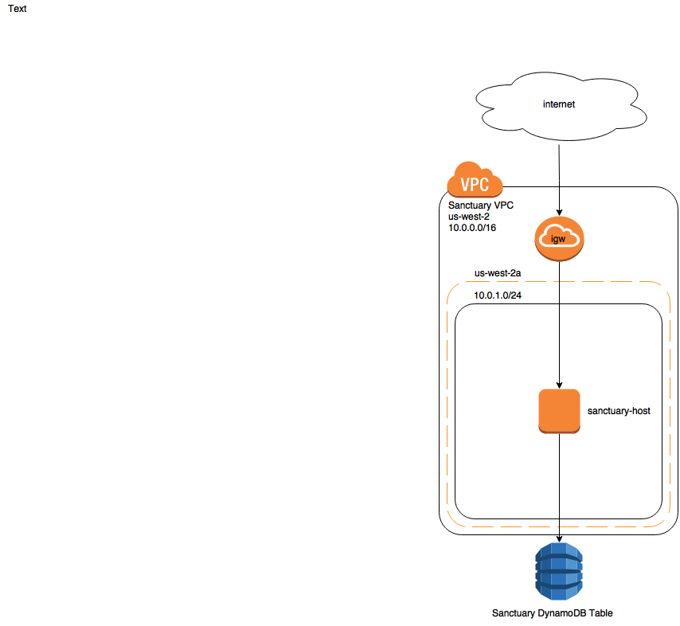

# Sanctuary


NOTE: This project is still a work-in-progress.

Sanctuary is a turn-key solution for establishing a production Vault service in the Cloud.



## Build Container
```
docker build -t drud/sancutary .
```

## Install
You can build out the Sanctuary infrastructure by running the following command
```
docker run \
  -e AWS_ACCESS_KEY_ID="$AWS_ACCESS_KEY_ID" \
  -e AWS_SECRET_ACCESS_KEY="$AWS_SECRET_ACCESS_KEY"  \
  -it --rm drud/sanctuary
```

**A file containing your keys is written in the container during install. For this reason
it is HIGHLY recommended you include the --rm flag when running the container. Backing up the keys
and root token are your own resposibility. It is also recommended you familiarize yourself
with the [security model](https://www.vaultproject.io/docs/internals/security.html) of vault**

# SSL

Sanctuary offers 3 different modes for managing SSL for your vault service.

### [Let's Encrypt](https://letsencrypt.org/)
With [let's encrypt](https://letsencrypt.org/) you are expected to provide the following environment variables
during setup

<dl>
  <dt>LE_DOMAIN</dt>
  <dd>The domain to generate certificates for.</dd>
  <dt>LE_EMAIL</dt>
  <dd>The administrative email to use when generating certificates.</dd>
</dl>

As a part the installation you will be asked to point the DNS for the LE_DOMAIN you chose
at the Sanctuary instance once it is created.

The following examples how show you would create a Sanctuary instance with let's encrypt
support.

```
docker run \
  -e AWS_ACCESS_KEY_ID="$AWS_ACCESS_KEY_ID" \
  -e AWS_SECRET_ACCESS_KEY="$AWS_SECRET_ACCESS_KEY"  \
  -e LE_DOMAIN="vault.example.com" \
  -e LE_EMAIL="admin@example.com" \
  -it --rm drud/sanctuary
```

### Provide Certificates

If you already have certificates generated for the vault domain you can mount them
into the container and Sanctuary will use them when installing. If you have your own certs they should be mounted into /etc/certs/{server.key,server.pem}.

This can be done like so:

```
docker run \
  -e AWS_ACCESS_KEY_ID="$AWS_ACCESS_KEY_ID" \
  -e AWS_SECRET_ACCESS_KEY="$AWS_SECRET_ACCESS_KEY"  \
  -it --rm -v /path/to/certs:/etc/certs drud/sanctuary
```

### Self-Signed Certificates
If you do not choose to provide your own certificates or use Let's Encrypt, then
Sanctuary will generate it's own self signed certificates during the installation process.

It is recommended that you use one of the other methods for a production deployment.


# GitHub Authentication
Sanctuary can automatically configure [GitHub authentication for vault](https://www.vaultproject.io/docs/auth/github.html).

To do this, just provide the following environment variables to the container when installing Sanctuary

<dl>
  <dt>GITHUB_ORGANIZATION</dt>
  <dd>The organization name a user must be a part of to authenticate.</dd>
  <dt>GITHUB_TEAM</dt>
  <dd>A team within that organization to give root level access to.</dd>
</dl>

# Vault Options
To configure the number of keys generated and the key threshold for unsealing vault, you can
include the following environment vars.

To do this, just provide the following environment variables to the container when installing Sanctuary

<dl>
  <dt>VAULT_KEY_SHARES</dt>
  <dd>The number of key shares to generate. Defaults to 5.</dd>
  <dt>VAULT_KEY_THRESHOLD</dt>
  <dd>The key threshold required to unseal vault. Defaults to 3.</dd>
  <dt>SKIP_UNSEAL</dt>
  <dd>Set to any value if you want to leave vault sealed after installation completes. Sanctuary
  will not be able to configure an auth backend for a sealed vault.</dd>
</dl>
